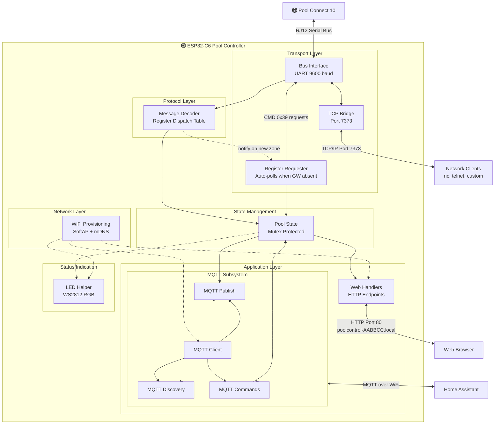

# Pool Controller

  [](https://github.com/marklynch/pool-controller-code/actions/workflows/build.yml
  )
  [](https://github.com/marklynch/pool-controller-code/releases)
  [](LICENSE)
  [](https://github.com/espressif/esp-idf)
  [](https://core-electronics.com.au/esp32-c6-mini-development-board-wifi6-bluetooth5.html)

Code to listen on and control a Connect 10 pool controller.  I created it as a learning project and happy to collaborate with people who find it useful.
This has been created by listening to the communications on the control bus, and decoding the instructions by trial and error.

An ESP32-C6 daisy-chains into the Connect 10's RJ12 bus, decodes the traffic, and bridges it to Home Assistant over MQTT — giving you the pool's state and controls alongside the rest of your home automation.

**Note** this is **not an official product** and does not come with support or any warranty and it is NOT connected to or supported by Fluidra.

## Contents

- [What It Does](#what-it-does)
- [Hardware](#hardware)
- [Setup](#setup) — connect, provision WiFi, connect Home Assistant
- [Power and Energy Monitoring](#power-and-energy-monitoring)
- [Web Interface](#web-interface)
- [Bus Debugging](#bus-debugging) — TCP port, decoder testing, message counters
- [Architecture](#architecture)
- [Development](#development) — building, tests, releases, installer
- [Related Documentation](#related-documentation)

## What It Does

Tested as working:

**Reads from the bus**
- Water temperature ✅
- Channel, light and heater configuration ✅
- Timers ✅
- ORP/pH settings ✅
- Config/state for the Internet Gateway ✅
- Touchscreen and Internet Gateway firmware versions ✅
- Pump speed and power from a Viron XT variable-speed pump ✅
- Auto-requests missing timer and light config when the Internet Gateway is absent ✅

**Controls**
- Lights — state, colour, zone name, multicolor capability ✅
- Channels — toggle On/Auto/Off ✅
- Heater on/off ✅
- Temperature set points for pool and spa ✅
- Pool/Spa mode ✅
- Valves ✅

**Beyond the bus**
- Home Assistant integration over MQTT, with auto-discovery ✅
- [Power and energy tracking](#power-and-energy-monitoring) per channel, for Home Assistant's Energy dashboard ✅
- Over-the-air firmware updates from GitHub releases ✅

## Hardware

1. [Controller code (this repo)](https://github.com/marklynch/pool-controller-code)
2. [Circuit and PCB design](https://github.com/marklynch/pool-controller-pcb)
3. ESP32-C6 - It's been designed around the [Waveshare ESP32-C6 Mini Development Board ](https://core-electronics.com.au/esp32-c6-mini-development-board-wifi6-bluetooth5.html)
4. [Case for Pool Controller](https://github.com/marklynch/pool-controller-case)

The assembled device has three connectors:

- **2 × RJ12 sockets** — for the pool control bus. Use a standard flat RJ12 cable to connect either socket to your Connect 10 system; this also powers the device. The two sockets are wired in parallel, so the second one can be used to daisy-chain another device (e.g. another controller, gateway, or accessory) on the same bus.
- **1 × USB-C socket** — for manually flashing firmware and serial monitoring from a computer. It is **not** required for normal operation.

## Setup

### 1. Connect and power the device

If the device hasn't been flashed yet, the quickest route is the [web installer](https://marklynch.github.io/pool-controller-code/) — plug the board into a computer over USB-C and flash the latest release from Chrome or Edge, no toolchain needed. After that, updates arrive over-the-air.

Then plug a flat RJ12 cable from the Connect 10 into either RJ12 socket. This both connects the device to the pool bus and powers it. Wait for the LED to turn **purple**, which means it's in provisioning mode and ready for WiFi setup.

### 2. Provision WiFi

1. When the LED is **purple**, the device is in provisioning mode.
2. On your phone, connect to the WiFi network named **`POOL_AABBCC`** (e.g. `POOL_A1B2C3`) — the `AABBCC` suffix is the last 3 bytes of the device's MAC address, unique to each device. The password is **`poolsetup`**.
3. In your phone's browser navigate to **http://192.168.4.1** and choose your WiFi network and enter the password.
4. The device will save the credentials to the device and restart. The LED will turn white then green once connected.

Once on your network the device is accessible at **`http://poolcontrol-AABBCC.local`** — the same `AABBCC` suffix as the AP you provisioned through, so `POOL_A1B2C3` becomes `http://poolcontrol-A1B2C3.local`. That hostname is used throughout the rest of this document.

**Note:** If the wrong password is entered the device will retry for about 30 seconds then return to provisioning mode.

**Note:** To re-provision, erase the flash ("Erase Flash Memory from device" in your IDE) to clear the saved credentials.

### 3. Connect Home Assistant

Home Assistant is the main interface to the device. Point it at your MQTT broker:

1. Browse to **`http://poolcontrol-AABBCC.local/mqtt_config`**.
2. Tick **Enable MQTT**, then fill in **Broker Host/IP** and **Port** (1883 unless you've changed it). **Username** and **Password** are optional — leave them empty if your broker doesn't require them.
3. Save. The LED turns **green** once the broker connects.

The device publishes Home Assistant MQTT discovery configs on every connect, so the entities appear by themselves — no YAML. You'll get the pool's temperatures, channels, lights, heaters, valves and chlorinator readings, plus buttons for reboot, firmware update and entity reset.

Two things are worth doing next:

- Enter wattages for your equipment so the power and energy sensors come to life — see [Power and Energy Monitoring](#power-and-energy-monitoring).
- Check the **Firmware** update entity, which offers over-the-air updates straight from GitHub releases — see [OTA_UPDATE.md](OTA_UPDATE.md).

### LED status reference

**Persistent states (solid colors)**

- **Blue** - Startup (brief, during boot)
- **Purple** - Unconfigured (no WiFi credentials, provisioning mode active)
- **White** - WiFi connected, waiting for MQTT connection
- **Green** - Fully operational (WiFi + MQTT connected) ✅
- **Orange** - MQTT disconnected (WiFi ok, MQTT issue)

**Activity indicators (brief flashes)**

- **Cyan flash** - RJ12 data received (RX)
- **Magenta flash** - RJ12 data transmitted (TX)

**Boot flow examples**

| First boot (no WiFi) | Normal boot | MQTT connection issue |
|---|---|---|
| Blue (startup) | Blue (startup) | Blue (startup) |
| Purple (connect to AP) | White (WiFi connected) | White (WiFi connected) |
| Configure WiFi → restart | Green (MQTT connected) ✅ | Orange (MQTT failed) |

## Power and Energy Monitoring

The Connect 10 doesn't meter power. The one exception is a Viron XT variable-speed pump, which broadcasts its real wattage on the bus — everything else (lights, heaters, blowers, cleaners) draws whatever it draws with nothing on the bus to say so.

So the device works from **wattage estimates you enter**, one per channel, plus a system baseline. From those it derives a live power sensor and a cumulative energy sensor per channel, which can be added to Home Assistant's Energy dashboard under **Individual devices**.

### Configuring wattages

Everything is configured from Home Assistant — there's no power configuration in the device's web UI. The number entities appear in the **Configuration** section of the device page:

| Entity | Sets |
|--------|------|
| `Power: <channel name>` | That channel's estimated draw while it's active, e.g. `Power: Filter`, `Power: Jets` |
| `Power: System` | The always-on baseline that belongs to no channel — the controller itself, chlorinator standby, and so on |

Values are in Watts (0–10000). Wattages are saved to NVS, so they survive reboots and firmware updates.

**0 means unset.** A channel with no configured wattage and no telemetry has no way to report anything, so its power and energy sensors aren't created at all — the number entity is all you'll see. Enter a wattage and the pair appears; set it back to 0 and they're removed again. The same applies to the system baseline.

Look at the equipment's nameplate for a figure, or measure it with a plug-in energy meter if you want better than a nameplate rating.

### How power is resolved

For each channel, in order:

1. **Real telemetry, if the device reports it.** Currently only the Filter channel, once a Viron XT variable-speed pump has broadcast an actual wattage. The configured estimate is then ignored, and the number entity is relabelled `Power: Filter (ignored: smart pump)` to say so. It stays editable — swap in a single-speed pump and the estimate takes over again on the next boot.
2. **The configured estimate, gated on the channel's active state.** Active → the configured figure; inactive → 0 W. A channel in Auto that a timer hasn't switched on reads 0 W.

The system baseline has no active state to gate on: if a baseline is configured, it's drawing, so it reports its configured figure continuously.

### Entities

Created per channel once it has a power source, and for the system baseline once one is configured:

| Entity | Type | Notes |
|--------|------|-------|
| `<name> Power` | Sensor, W | Live draw as resolved above. `device_class: power`, `state_class: measurement` |
| `<name> Energy` | Sensor, kWh | Cumulative total, integrated on-device. `device_class: energy`, `state_class: total_increasing` |

Entity IDs follow the usual scheme — `number.pool_control_<mac>_channel_5_configured_power`, `sensor.pool_control_<mac>_channel_5_power`, `sensor.pool_control_<mac>_channel_5_energy`, and `system_configured_power` / `system_power` / `system_energy` for the baseline.

Wattages can also be set over MQTT directly, by publishing a number to `pool/<device_id>/channel/<N>/power/set` or `pool/<device_id>/system/power/set`.

### Energy accumulation

The device integrates each channel's effective power into a running kWh total itself, rather than leaving it to a Home Assistant Riemann sum helper. The accumulator samples every **10 seconds** and publishes every **5 minutes**, plus one final value on the sample where a channel stops drawing so a run's total lands in the right time bucket. Sampling and publishing are deliberately separate: 10 seconds keeps a channel toggling mid-interval from skewing the total, while publishing that fast would flood HA's event log and recorder database with rows carrying no new information.

Two things worth knowing:

- **Don't add a Riemann sum helper over the Power sensors.** The Energy sensors already integrate the same readings, and feeding both to the Energy dashboard double-counts.
- **Totals reset to 0 on reboot.** The accumulator lives in RAM only. `state_class: total_increasing` tells Home Assistant to treat the drop as a meter reset rather than negative consumption, so long-term statistics stay intact — history before the reboot is kept, and accumulation resumes from zero.

Accuracy is only as good as the numbers entered. For anything on the bus with real telemetry the figures are exact; for everything else they're a nameplate rating multiplied by the time the channel was active.

## Web Interface

The device serves a small web UI and JSON API at `http://poolcontrol-AABBCC.local`:

| Path | What it is |
|------|------------|
| `/` | Home page — system summary, hostname, message counters |
| `/status_view` | Human-readable pool state |
| `/status` | The same state as JSON, plus firmware version and [message counters](#message-counters) |
| `/mqtt_config` | Broker settings — see [Setup step 3](#3-connect-home-assistant) |
| `/update` | Firmware update — check/install from GitHub, or upload a `.bin` manually |
| `/unknown_msgs_view` | Bus messages the decoder has no handler for, with a button to clear the buffer |
| `/unknown_msgs` | The same buffer as JSON |
| `/api/test_decode` | POST a hex frame to run it through the decoder — see [Testing message decoding](#testing-message-decoding) |
| `/reboot`, `/ha-reset` | POST endpoints behind the Reboot and Reset entities buttons on the update page |

`/wifi`, `/scan` and `/provision` are served only in provisioning mode, and are covered by [Setup step 2](#2-provision-wifi).

## Bus Debugging

### TCP debug port 7373

The device exposes a raw TCP server on port 7373 that streams all bus traffic as hex and forwards any bytes you send back onto the bus. It also mirrors the device's log output, so you can monitor activity without a USB cable.

Connect to it at the device's hostname — `poolcontrol-A1B2C3.local` for a device provisioned via `POOL_A1B2C3`.

**Mac / Linux** — use `nc` (netcat), which is installed by default:

```bash
nc poolcontrol-A1B2C3.local 7373
```

Example session:
```
Connected to pool control bus bridge.
UART bytes will be shown here in hex.
Bytes you send will be forwarded to the bus.

00
02 00 50 FF FF 80 00 FD 0F DC 19 0E 01 28 03
00
```

To send a raw command to the bus, type the bytes as a hex string and press Enter:
```
02 00 F0 00 50 80 00 39 0F 0E E7 01 00 00 03
```

**Windows** — three options:

1. **PuTTY (recommended)** — [download it](https://www.chiark.greenend.org.uk/~sgtatham/putty/latest.html), set **Connection type** to **Raw**, enter `poolcontrol-A1B2C3.local` as the host and `7373` as the port, then click **Open**.
2. **Telnet** — if the client is enabled (Control Panel → Programs → Turn Windows features on/off → Telnet Client): `telnet poolcontrol-A1B2C3.local 7373`
3. **WSL** — use `nc` exactly as on Mac/Linux.

### Testing message decoding

You can test individual messages against the decoder using the HTTP API endpoint:

```bash
curl -X POST http://poolcontrol-A1B2C3.local/api/test_decode \
  -d "02 00 50 FF FF 80 00 38 0F 17 D0 01 02 1A 03"
```

**Response:**
```json
{
  "success": true,
  "decoded": true,
  "length": 15,
  "hex": "02 00 50 FF FF 80 00 38 0F 17 D0 01 02 1A 03",
  "message": "Check ESP logs for decode details"
}
```

- `decoded: true` - Pattern matched and message was decoded
- `decoded: false` - Unknown message type

**To see full decode details**, monitor the ESP logs:
```bash
idf.py monitor
```

You'll see output like:
```
I (12345) MSG_DECODER: [Controller -> Broadcast] Lighting zone 1 state - On
```

This allows you to quickly test message patterns and verify decoder behavior without needing to send messages to the actual bus.

### Message counters

The device keeps global counters of all bus traffic, shown in the **Messages** row of the home page and in the `/status` JSON:

```json
"message_counts": {
  "decoded": 12345,
  "unknown": 67,
  "errors": 3,
  "error_detail": {
    "no_start_byte": 0,
    "bad_control": 1,
    "no_end": 2,
    "bad_framing": 0,
    "length_mismatch": 0,
    "header_checksum": 0,
    "data_checksum": 0
  }
}
```

- **decoded** — frames matched and handled by the decoder
- **unknown** — well-formed frames the decoder has no handler for
- **errors** — frames or byte stretches broken at the protocol level

The three buckets are exclusive: `decoded + unknown + errors` equals the total traffic seen. A frame with a validation error is still dispatched to the decoder, but counts only as an error.

`error_detail` breaks errors down by type:

| Type | Detected by | Meaning |
|------|-------------|---------|
| `no_start_byte` | frame reassembly | Buffer contained no START byte (`0x02`); all bytes discarded |
| `bad_control` | frame reassembly | START byte found but control bytes weren't `80 00`; resynced by one byte |
| `no_end` | frame reassembly | Buffer filled without a valid data checksum + END (`0x03`) match — an over-long message or a corrupted data checksum (indistinguishable, since the checksum is used to locate the end of frame) |
| `bad_framing` | decoder | Frame shorter than 12 bytes or missing START/END markers |
| `length_mismatch` | decoder | Length field (byte 8) didn't match the actual frame length |
| `header_checksum` | decoder | Header checksum (byte 9) didn't match the sum of bytes 0–8 |
| `data_checksum` | decoder | Data checksum didn't match (defensive — frame reassembly already validates it) |

The frame-reassembly counters count discard *events*, not messages: a single corrupt stretch can increment `bad_control` once per stray `0x02` it contains, and `no_start_byte` counts whole-buffer discards. Treat them as bus-corruption indicators rather than exact message counts.

## Architecture



An ESP32-C6 module daisy-chains into an existing Connect 10 system over RJ12, which both carries the bus and powers it. The bus interface hands raw UART bytes to the message decoder, which updates a mutex-protected pool state; that state is what the MQTT publishers and web handlers read from. Commands travel the other way — from Home Assistant or a TCP client — back onto the bus.

Each box in the diagram is a module in `main/`, named after it — `bus.c`, `message_decoder.c`, `pool_state.c`, `tcp_bridge.c`, `register_requester.c`, `web_handlers.c`, `led_helper.c`, and the `mqtt_*.c` set.

## Development

### Building and flashing

This project uses ESP-IDF v5.5+ with the environment sourced (`. $IDF_PATH/export.sh`).

```bash
idf.py build          # Build the project
idf.py flash monitor  # Flash to device and monitor output
```

### Tests

The decoder is tested on the host — no device required — by replaying captured bus logs through `message_decoder.c` and diffing the output, alongside conventional unit tests:

```bash
bash test/run_tests.sh
```

See [docs/testing.md](docs/testing.md) for the VS Code tasks, how to add a regression sample, blessing goldens after an intentional decoder change, and the frame-parser tests.

### Releases

Releases are produced by a GitHub Actions workflow (`.github/workflows/build.yml`) that fires on any tag matching `v*`. To cut a release:

```bash
git tag -a v1.0.0 -m "Release v1.0.0"
git push origin v1.0.0
```

The workflow will:

1. Build the firmware with `PROJECT_VER` set to the tag name (embedded into the binary and visible via the device's `/status` page).
2. Create a draft GitHub Release with auto-generated notes.
3. Attach two assets:
   - `pool-controller-update-v1.0.0.bin` — app-only binary, used by both the `/update` upload flow and the GitHub auto-update (the device downloads this asset by name).
   - `pool-controller-full-v1.0.0.bin` — merged bootloader + partition table + otadata + app, for first-time flashing via `esptool.py --chip esp32c6 write_flash 0x0 pool-controller-full-v1.0.0.bin`.
4. Publish the draft.

The published release appears at `https://github.com/marklynch/pool-controller-code/releases/tag/v1.0.0`.

To re-test the workflow without cutting a real release, run it manually from the Actions tab (Build & Release → Run workflow). Manual runs build the firmware and upload it as a workflow artifact but do not create a GitHub Release.

### Web installer

<https://marklynch.github.io/pool-controller-code/> flashes the latest release onto an ESP32-C6 from desktop Chrome or Edge, with no toolchain. The page source is in `installer/`, but the published site is assembled by `installer/build-site.sh` rather than served as-is.

See [docs/installer.md](docs/installer.md) for how the site is built and deployed, why ESP Web Tools is vendored rather than loaded from a CDN, and how to preview it locally.

## Related Documentation

### [PROTOCOL.md](PROTOCOL.md) — Bus Protocol Reference

Documents the proprietary serial protocol used by the Connect 10, reverse-engineered by sniffing bus traffic. Covers:

- **Message framing** — `START (0x02) | SRC | DST | CTRL | CMD | DATA | CHECKSUM | END (0x03)`
- **Device addresses** — Touch screen (`0x0050`), controller (`0x006F`), chlorinator (`0x0090`), internet gateway (`0x00F0`)
- **30+ decoded message types** — temperatures, channel states, lighting zones (state, colour, name, multicolor capability), chlorinator pH/ORP, controller clock, firmware versions, gateway network status, and more
- **Register system** — A unified register/slot dispatch mechanism used for channel names, types, lighting colors, and labels
- **Control commands** — How to toggle channels, set temperature setpoints, control lighting zones, switch pool/spa mode, and control the heater (all by impersonating the internet gateway address `0x00F0`)
- **Checksum algorithm** and message validation rules

### [OTA_UPDATE.md](OTA_UPDATE.md) — Over-The-Air Firmware Updates

Describes the OTA update system. Covers:

- **Update from GitHub** — The device checks the GitHub *latest release* on a schedule and can download/install it on demand from the `/update` page or the Home Assistant `update` entity — no local file handling
- **Home Assistant update entity** — A "Firmware" update entity shows installed/latest versions and installs with the HA *Install* button, reporting download progress
- **Manual upload** — Build the `.bin`, navigate to `http://<device-ip>/update`, upload via the web form
- **Dual-partition layout** — Updates alternate between `ota_0` and `ota_1`, with automatic rollback if the new firmware fails to boot
- **Safety** — Image validation before write, boot confirmation required by new firmware, rollback after 3 failed boots
- **Version information** — Version string generated from `git describe` (e.g. `v1.0.0-5-g870d65b`)
- **Security notes** — No authentication on the update endpoints currently; see the doc for recommended production hardening

### Also in this repo

- [docs/testing.md](docs/testing.md) — running and extending the host-based test suite
- [docs/installer.md](docs/installer.md) — how the web installer is built, vendored and deployed
- [CHANGELOG.md](CHANGELOG.md) — release history
